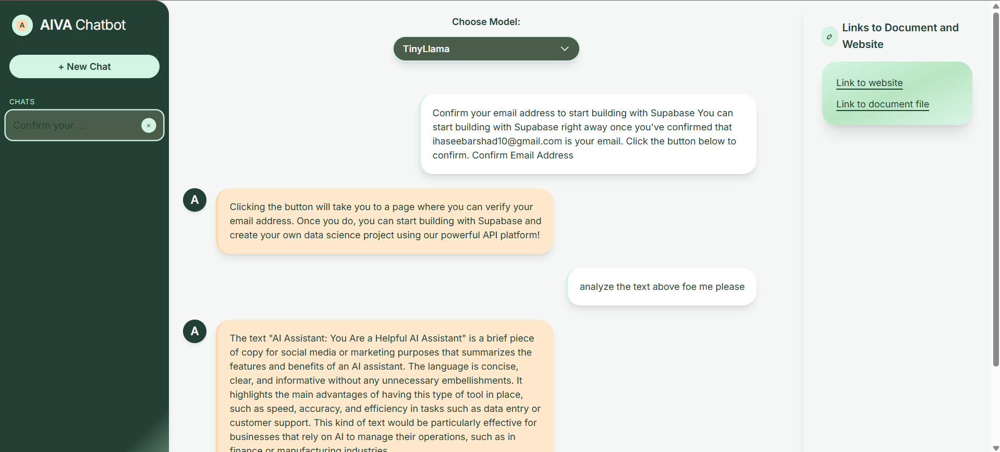

Here's a slightly improved version of your README with clearer structure, smoother wording, and a touch of polish—without changing any of the image links or breaking formatting:

---

# AIVA Prompt Improver: Local-First AI Prompt Enhancement Dashboard



---

## 🚀 Overview

**AIVA Prompt Improver** is a privacy-first, local AI assistant designed to help you rewrite and refine prompts for AI models. It runs entirely on your machine—**no cloud, no external APIs**—delivering enhanced prompts through a sleek, modern interface.

---

## 🏗️ Architecture & Tech Stack

* **Frontend:** React (Vite) + Tailwind CSS
* **Backend:** Node.js (Express)
* **LLM Serving:** Ollama (TinyLlama, Phi-3)
* **Storage:** Browser `localStorage` (chat sessions)
* **Privacy:** 100% local processing

---

## 📁 Project Structure

```
New_Chatbot/
├── 1.png                # Dashboard screenshot
├── backend/             # Node.js server
│   ├── index.js         # Express backend
│   ├── package.json     # Backend dependencies
├── frontend/            # React UI
│   ├── index.html       # HTML entry point
│   ├── package.json     # Frontend dependencies
│   ├── tailwind.config.js # Custom theme
│   ├── postcss.config.js  # Tailwind/PostCSS setup
│   └── src/
│       ├── App.jsx      # App logic
│       ├── index.jsx    # React entry point
│       ├── index.css    # Global styles
│       └── components/  # UI components
├── main_ideas.txt       # Vision & design notes
└── README.md            # This file
```

---

## ✨ Key Features

### Frontend (React + Tailwind)

* **Modern UI:** Chat layout, sidebar navigation, model selector, and input bar
* **Chat History:** Persistent sessions, switch between chats, create/delete easily
* **Prompt Rewriting:** Improve clarity, structure, and depth of user prompts
* **Model Switching:** Instantly toggle between TinyLlama and Phi-3
* **Contextual Tips:** Prompt writing best practices in a collapsible context panel
* **Responsive Layout:** Optimized for desktop and tablet screens

### Backend (Node.js + Express)

* **/chat Endpoint:** Sends prompts to Ollama with prompt-improvement instructions
* **Local-Only:** No remote API calls or cloud processing

---

## 🖼️ Dashboard Preview


---

## 🛠️ Setup Guide

### 1. Prerequisites

* [Node.js](https://nodejs.org/) (v16 or higher)
* [npm](https://www.npmjs.com/) (comes with Node.js)
* [Ollama](https://ollama.com/) (for local LLM serving)

### 2. Clone the Repository

```bash
git clone <your-repo-url>
cd New_Chatbot
```

### 3. Start the Backend

```bash
cd backend
npm install
node index.js
# Runs on http://localhost:3001
```

### 4. Start the Frontend

```bash
cd ../frontend
npm install
npm run dev
# Runs on http://localhost:5173
```

### 5. Set Up Ollama

* Install from [Ollama.com](https://ollama.com/)
* Pull required models:

```bash
ollama pull tinyllama
ollama pull phi3
ollama run phi3
```

* Default API endpoint: `http://localhost:11434`

---

## 🧑‍💻 Usage Instructions

1. Start the backend: `node backend/index.js`
2. Launch Ollama: `ollama run phi3` (or any supported model)
3. Run the frontend: `npm run dev` inside `frontend/`
4. Open [http://localhost:5173](http://localhost:5173) in your browser
5. Paste or write a prompt and get a refined version instantly

---

## 🎨 Design Language

* **Palette:** Deep green, olive, mint, pastel green, peach, cream
* **Typography:** Inter, Manrope (Google Fonts)
* **Cards:** `rounded-2xl`, `shadow-lg`, `p-4`
* **Buttons:** `rounded-2xl`, hover effects, transitions
* **Responsive:** Flex and max-width utilities for smooth scaling

---

## 🔒 100% Local Guarantee

* All processing is done on-device
* No cloud services, no data sent externally
* Ideal for privacy-conscious users and secure environments

---

## 🔧 Customization

* **Add new models:** Modify the `MODELS` array in `App.jsx`
* **Update theme/colors:** Edit `tailwind.config.js`
* **Extend APIs:** Add new routes to `backend/index.js`

---

## 🐞 Troubleshooting

* **Ollama not responding?**
  Ensure `ollama run <model>` is running and port 11434 is free.

* **Frontend can't talk to backend?**
  Check CORS headers and confirm both services are running on expected ports.

* **Moved folders or changed structure?**
  Update any hardcoded paths and recheck your config files.

---

## 🙌 Credits

* **Ollama** — For local model serving
* **React + Tailwind** — For the flexible, beautiful UI

---

## 📄 Vision & Roadmap

See `main_ideas.txt` for insights into the project's long-term goals and design thinking.

---

**Enjoy building with your fully local AI Prompt Improver!** 🔧💡

Let me know if you want a minimal version, or one tailored for GitHub with badges and links.
